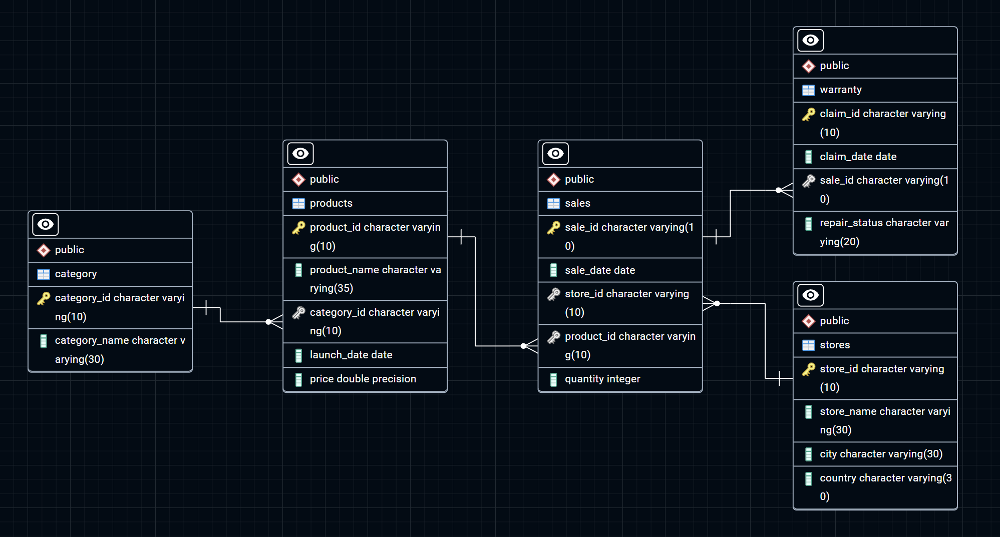

# Apple Retail Sales Analysis using SQL

### Advanced SQL Analysis of Apple Retail Sales Data

This project demonstrates advanced SQL querying techniques on a dataset of over **1 million rows** from Apple retail sales. It highlights the ability to optimize query performance, solve real-world business problems, and extract actionable insights from large datasets.

---

## 📌 Table of Contents
1. Project Overview
2. Database Schema
3. Entity Relationship Diagram (ERD)
4. Skills Highlighted
5. Key Business Questions Solved
6. Performance Optimization

---

## 📖 Project Overview
The goal of this project was to analyze Apple retail sales data, providing insights into **store performance, product trends, and warranty claims**. By leveraging advanced SQL features, the project addresses real-world business challenges and demonstrates efficient data processing techniques that can scale to millions of rows.

---

## 🗂️ Database Schema
The database consists of five main tables:

- **stores**: Information about Apple retail stores (eg. store ID, name, city, country).
- **category**: Product categories (eg. category ID, category name).
- **products**: Details about Apple products (eg. product ID, name, launch date, price).
- **sales**: Sales transactions (eg. sale date, store ID, product ID, quantity).
- **warranty**: Warranty claims (eg. claim date, repair status).

Refer to the `schema.sql` file for detailed table definitions.

---

## 📊 Entity Relationship Diagram (ERD)
The following ERD shows the relationship between tables in the Apple Retail Sales Database:

---

## 🛠️ Skills Highlighted
- **Performance Optimization**: Implemented indexes to significantly improve query speeds.
- **Window Functions**: Applied for ranking, running totals, and year-over-year growth analysis.
- **Complex Joins & Aggregations**: Extracted insights from multiple interconnected tables.
- **Data Segmentation**: Analyzed product and store performance across different regions and timeframes.
- **Correlation Analysis**: Explored links between product price and warranty claims.

---

## ❓ Key Business Questions Solved
1. How many stores exist in each country?
2. Which store sold the highest number of units in the past year?
3. What is the average price of products in each category?
4. What percentage of warranty claims were rejected?
5. Which store had the highest percentage of completed warranty claims?
6. What is the least-selling product in each country for each year?
7. How many warranty claims were filed within 180 days of purchase?
8. What is the year-over-year growth ratio for each store?
9. What is the monthly running total of sales for each store over the past four years?

👉 For the complete list of queries and results, check the `queries.sql` file.

---

## ⚡ Performance Optimization

To handle over 1 million rows efficiently, indexes were created on key columns. This reduced query execution time significantly and improved overall performance.

**Indexes created:**
- `sales_product_id` on `sales(product_id)`
- `sales_store_id` on `sales(store_id)`
- `sales_quantity` on `sales(quantity)`
- `sale_date` on `sales(sale_date)`
- `sales_product_id_store_id` on `sales(product_id, store_id)`

---

## 📝 Explanation
This project analyzed Apple retail sales data with over **1 million rows**, including details about **products, sales transactions, stores, and warranty claims** from worldwide retail locations.

Key outcomes included:
- Identifying store-level and country-level performance.
- Finding the best-selling and least-selling products.
- Analyzing warranty claim patterns.
- Measuring year-over-year growth using **window functions**.

A major achievement was **performance tuning**: queries that initially ran slowly became much faster after indexing critical columns.

This project reflects practical experience in handling large datasets, applying advanced SQL techniques, and turning raw data into actionable insights.
